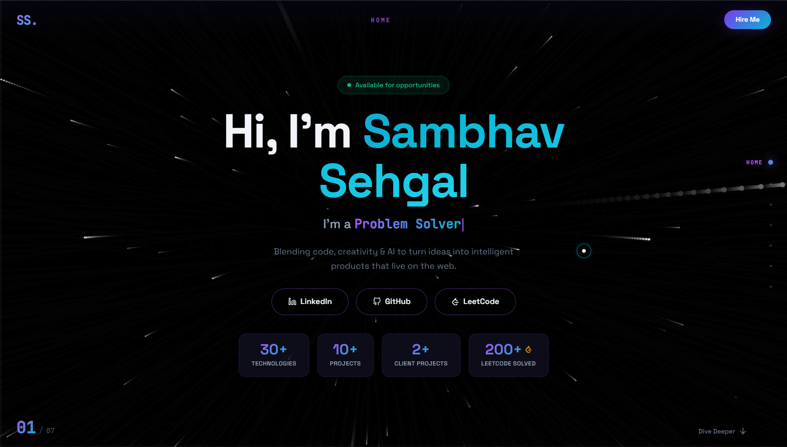

<h1 align="center">Sambhav Sehgal Portfolio</h1>

<p align="center">
  Full-Stack Developer Portfolio built with React, Vite, Framer Motion, and a custom 3D tunnel experience.
</p>

<p align="center">
  <a href="https://sambhavsehgal.vercel.app" target="_blank">
    
  </a>
  <a href="https://github.com/sambhav-007" target="_blank">
    
  </a>
  <a href="https://www.linkedin.com/in/sambhav-sehgal-35896a334/" target="_blank">
    
  </a>
  <a href="https://leetcode.com/u/sambhavsehgal/" target="_blank">
    
  </a>
</p>

---

## About The Project

This repository contains my personal portfolio website with a cinematic, interactive tunnel-style navigation system.

It showcases:
- Professional experience
- Real project work
- Technical stack and skill depth
- Leadership and achievements
- Contact and social profiles

The site is designed for smooth transitions, strong visual identity, and recruiter-friendly storytelling.

---

## Visual Preview

<p align="center">
  
</p>

---

## Core Features

- Custom dual-slot tunnel slide architecture for seamless transitions
- High-performance Framer Motion interactions and reveal animations
- Dynamic hero section with role typing effect
- Live-style LeetCode solved count display with fallback handling
- Tech arsenal visualization with realistic progress indicators
- Experience timeline with impact-focused role summaries
- Projects grid with external links and accent-themed cards
- Custom animated cursor with subtle trailing glow
- Vertical edge-based slide progress indicator
- SEO setup with metadata, Open Graph tags, Twitter card, schema, robots, and sitemap

---

## Tech Stack

### Frontend
- React 18
- Vite 5
- Framer Motion
- CSS Modules
- React Icons

### Tooling
- npm
- Vercel (deployment)

---

## Project Structure

```text
SambhavSehgal/
├── portfolio/
│   ├── public/
│   │   ├── logos/
│   │   ├── favicon.svg
│   │   ├── og-image.svg
│   │   ├── robots.txt
│   │   ├── sitemap.xml
│   │   └── site.webmanifest
│   ├── src/
│   │   ├── components/
│   │   ├── hooks/
│   │   ├── App.jsx
│   │   └── main.jsx
│   ├── index.html
│   ├── package.json
│   └── vite.config.js
└── README.md
```

---

## Run Locally

### 1. Clone

```bash
git clone https://github.com/sambhav-007/SambhavSehgal.git
cd SambhavSehgal/portfolio
```

### 2. Install dependencies

```bash
npm install
```

### 3. Start development server

```bash
npm run dev
```

### 4. Build production

```bash
npm run build
```

### 5. Preview production build

```bash
npm run preview
```

---

## Deployment (Vercel)

This repository uses a subfolder setup where the app lives in portfolio.

Use these settings in Vercel:
- Framework Preset: Vite
- Root Directory: portfolio
- Build Command: npm run build
- Output Directory: dist

The file portfolio/vercel.json includes SPA rewrite support.

---

## SEO Setup Included

The project already includes:
- Canonical URL
- Meta description and robots directives
- Open Graph and Twitter tags
- Person schema in JSON-LD
- robots.txt
- sitemap.xml
- Social preview image

If you use a custom domain later, update domain URLs in:
- portfolio/index.html
- portfolio/public/robots.txt
- portfolio/public/sitemap.xml

---

## Contact

- Email: sambhav.sehgal.007@gmail.com
- LinkedIn: https://www.linkedin.com/in/sambhav-sehgal-35896a334/
- GitHub: https://github.com/sambhav-007
- LeetCode: https://leetcode.com/u/sambhavsehgal/

---

## Star This Repo

If you like the project, a star helps and is always appreciated.
