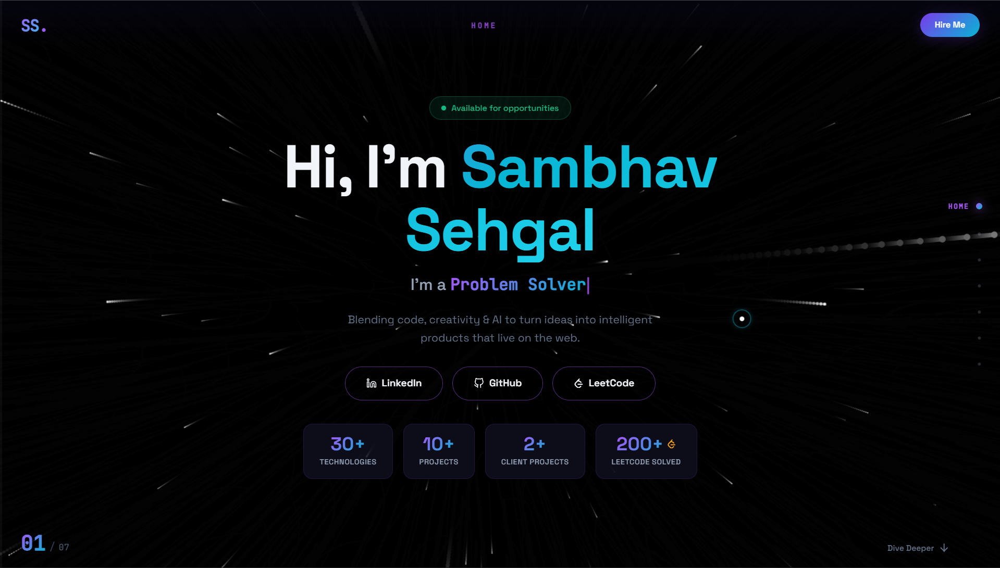

<h1 align="center">Sambhav Sehgal Portfolio</h1>

<p align="center">
  Cinematic full-stack developer portfolio built with React, Vite, Framer Motion, and React Three Fiber.
</p>

<p align="center">
  <a href="https://sambhavsehgal.vercel.app" target="_blank">
    
  </a>
  <a href="https://github.com/sambhav-007" target="_blank">
    
  </a>
  <a href="https://www.linkedin.com/in/sambhav-sehgal-35896a334/" target="_blank">
    
  </a>
  <a href="https://leetcode.com/u/sambhavsehgal/" target="_blank">
    
  </a>
</p>

---

## About

This repository contains my personal portfolio website with a cinematic 3D launch intro and tunnel-style slide navigation.

It highlights:
- About and profile snapshot
- Technical arsenal and skill groups
- Experience and project work
- Achievements and milestones
- Contact and social links

---

## Visual Preview

<p align="center">
  
</p>

---

## Core Features

- 3D launch intro with Milano spaceship GLTF model, animated portal, and space-jump transition
- Drag and scroll controls on launch screen with skip fallback
- Custom dual-slot tunnel architecture for seamless slide transitions
- Framer Motion animations across headers, panels, overlays, and modals
- Dynamic hero with role typing and live LeetCode solved count fetch (fallback included)
- Multi-theme popup picker with persistence via localStorage
- Theme presets: Space, Cookies n Creme, Dark Blood, Cyberpunk
- Theme-aware particle engine and color system for UI surfaces, nav, and actions
- Interactive Buy Me a Snack vending-style modal with cart, quantities, and QR checkout flow
- Vertical slide progress indicator and side navigation dots
- SEO-ready setup (Open Graph, Twitter metadata, robots, sitemap, manifest)

---

## 3D Spaceship Intro

Yes, the spaceship model is included and used in the app.

- Model file: `portfolio/public/models/milano/Milano_GotG.gltf`
- Binary data: `portfolio/public/models/milano/Milano_GotG.bin`
- Textures:
  - `portfolio/public/models/milano/images/00_BaseColor_Lite.jpg`
  - `portfolio/public/models/milano/images/00_Emissive_Lite.jpg`
- Runtime component: `portfolio/src/components/LaunchIntro.jsx`

The launch sequence includes:
- Boot-terminal loading overlay
- Interactive model framing and camera control
- Animated portal effect and jump transition into the portfolio

---

## Tech Stack

### Frontend
- React 18
- Vite 5
- Framer Motion
- CSS Modules
- React Icons

### 3D and Effects
- three
- @react-three/fiber
- @react-three/drei

### Tooling and Deployment
- npm
- Vercel

---

## Project Structure

```text
SambhavSehgal/
├── portfolio/
│   ├── public/
│   │   ├── image.png
│   │   ├── Gpay-QR.jpg
│   │   ├── models/
│   │   │   └── milano/
│   │   │       ├── Milano_GotG.gltf
│   │   │       ├── Milano_GotG.bin
│   │   │       └── images/
│   │   ├── robots.txt
│   │   ├── sitemap.xml
│   │   └── site.webmanifest
│   ├── src/
│   │   ├── components/
│   │   ├── hooks/
│   │   ├── App.jsx
│   │   └── main.jsx
│   ├── index.html
│   ├── package.json
│   ├── vercel.json
│   └── vite.config.js
└── README.md
```

---

## Run Locally

### 1. Clone

```bash
git clone https://github.com/sambhav-007/SambhavSehgal.git
cd SambhavSehgal/portfolio
```

### 2. Install dependencies

```bash
npm install
```

### 3. Start development server

```bash
npm run dev
```

### 4. Build production

```bash
npm run build
```

### 5. Preview production build

```bash
npm run preview
```

---

## Deployment (Vercel)

This app is deployed from the `portfolio` subfolder.

Use these Vercel settings:
- Framework Preset: Vite
- Root Directory: portfolio
- Build Command: npm run build
- Output Directory: dist

`portfolio/vercel.json` includes SPA rewrite support.

---

## SEO Setup

Included in the project:
- Canonical and social metadata in `portfolio/index.html`
- Open Graph and Twitter card tags
- robots.txt
- sitemap.xml
- Web manifest

If you switch to a custom domain, update URLs in:
- `portfolio/index.html`
- `portfolio/public/robots.txt`
- `portfolio/public/sitemap.xml`

---

## Contact

- Email: sambhav.sehgal.007@gmail.com
- LinkedIn: https://www.linkedin.com/in/sambhav-sehgal-35896a334/
- GitHub: https://github.com/sambhav-007
- LeetCode: https://leetcode.com/u/sambhavsehgal/

---

## Star This Repo

If you like this project, a star is appreciated.
